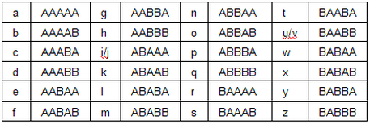

# Mechanics

How does the cipher work? Demo an encryption and decryption Is it symmetric, does the same process decrypt as encrypt?

The cipher works kind of like binary starting with 0 to 23 with 0s being A and 1s being B. 
0 would be A and 23 would be Z
The cipher does combine i with j and u with v.

"abhay" would be split into letters then turned into decimal numbers and then into the "Baconian Binary" so it would be:

| Letter      | Decimal     |"Baconian Binary"|
| ----------- | ----------- |---------------- |
| a           | 0           | AAAAA           |
| b           | 1           | AAAAB           |
| h           | 7           | AABBB           |
| a           | 0           | AAAAA           |
| y           | 22          | BABBA           |

Then it would be recombined to be AAAAA AAAAB AABBB AAAAA BABBA

Then when you want to decrypt it you would split it every 5th letter then turn convert every letter by reading it like binary and the decimal number that you get would become the letter in the normal alphabet, like this:

|"Baconian Binary"| Decimal     |Letter|
| ----------- | ----------- |---------------- |
| AAAAA       | 0           |  a         |
| AAAAB       | 1           |   b       |
| AABBB      | 7           |   h        |
| AAAAA         | 0           |    a     |
| BABBA        | 22          |   y      |

Which would make " AAAAB AABBB AAAAA BABBA" == "abhay"

This proves that baons cypher is symmetric because you use the same method to encrypt as decrypting it.
